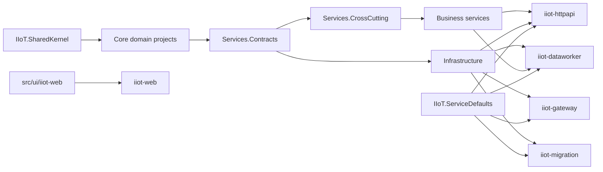

# Cloud build granularity plan

本文只记录 Cloud 镜像构建粒度的依赖事实和后续方案，不是部署执行入口。本次不修改 `cloud-image.yml` 的路径映射，避免在没有完整验证前漏构建生产镜像。日常部署流程必须以 `deploy/README.md` 和 `deploy/OPERATIONS.md` 为准。

## 当前构建口径

`cloud-image` 已经按 matrix 构建五个应用镜像：

- `httpapi`
- `gateway`
- `dataworker`
- `migration`
- `web`

当前规则保守：宿主目录只构建对应镜像；`src/core/`、`src/shared/`、`src/services/`、`src/infrastructure/` 或构建配置变更会构建全部应用镜像。`workflow_dispatch` 手动触发是全量重建入口，不属于日常按需部署流程。

## 真实项目引用

关键事实：

- `IIoT.HttpApi` 引用 Dapper、EF、EventBus、Infrastructure、Employee/Identity/MasterData/Production services、Contracts、CrossCutting、ServiceDefaults。
- `IIoT.DataWorker` 引用 Dapper、EF、EventBus、Infrastructure、ProductionService、Contracts、CrossCutting、ServiceDefaults。
- `IIoT.MigrationWorkApp` 引用 Dapper、EF、Infrastructure、ServiceDefaults。
- `IIoT.Gateway` 引用 Infrastructure、ServiceDefaults。
- `IIoT.AppHost/iiot-web.Dockerfile` 和 `src/ui/iiot-web/` 只影响 `iiot-web` 镜像。

## 后续可选收窄方案

只有在单独确认后才改 workflow。建议映射如下：

| 变更路径 | 建议构建 |
| --- | --- |
| `src/hosts/IIoT.HttpApi/**` | `httpapi` |
| `src/hosts/IIoT.Gateway/**` | `gateway` |
| `src/hosts/IIoT.DataWorker/**` | `dataworker` |
| `src/hosts/IIoT.MigrationWorkApp/**` | `migration` |
| `src/hosts/IIoT.ServiceDefaults/**` | `httpapi,gateway,dataworker,migration` |
| `src/services/IIoT.ProductionService/**` | `httpapi,dataworker` |
| `src/services/IIoT.EmployeeService/**`、`src/services/IIoT.IdentityService/**`、`src/services/IIoT.MasterDataService/**` | `httpapi` |
| `src/services/IIoT.Services.Contracts/**`、`src/services/IIoT.Services.CrossCutting/**` | `httpapi,gateway,dataworker,migration` |
| `src/infrastructure/IIoT.Dapper/**`、`src/infrastructure/IIoT.EntityFrameworkCore/**`、`src/infrastructure/IIoT.EventBus/**`、`src/infrastructure/IIoT.Infrastructure/**` | `httpapi,gateway,dataworker,migration` |
| `src/core/**`、`src/shared/**` | 先保持 `httpapi,gateway,dataworker,migration`，除非进一步拆出稳定边界 |
| `src/ui/iiot-web/**`、`src/hosts/IIoT.AppHost/iiot-web.Dockerfile` | `web` |

## 执行前必须验证

1. 用 `dotnet build` 分别验证 `IIoT.HttpApi`、`IIoT.Gateway`、`IIoT.DataWorker`、`IIoT.MigrationWorkApp`。
2. 对每个收窄映射做一次模拟 changed-files 输入，确认不会漏掉依赖宿主。
3. 只在确认后修改 `cloud-image.yml`，并保留 `workflow_dispatch` 作为明确全量重建和应急恢复入口；日常部署不得使用该入口。
